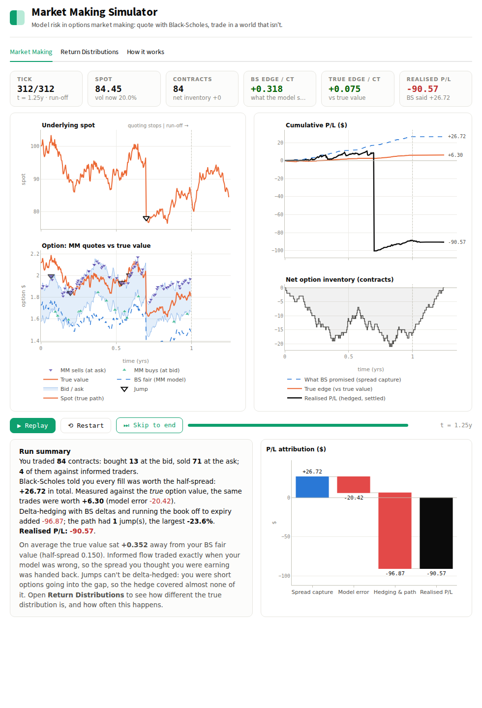
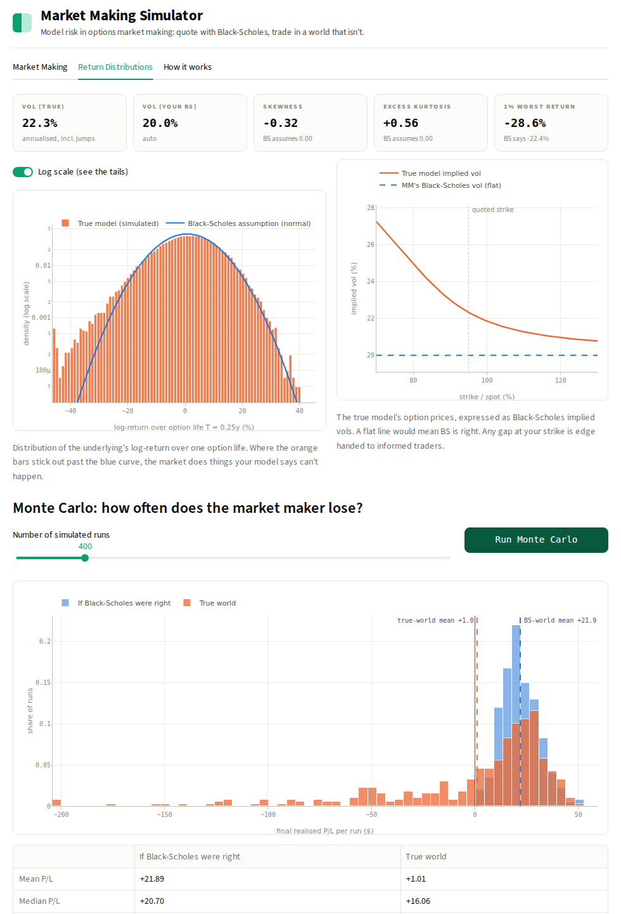

# Market Making Simulator

**Model risk in options market making: quote with Black-Scholes, trade in a world that isn't.**

[](https://YOUR-APP-NAME.streamlit.app)
[](https://github.com/YOUR-USERNAME/market-making-simulator/actions/workflows/tests.yml)



You are an options market maker. You price a rolling option with **Black-Scholes**, quote a bid and
an ask around it, delta-hedge your book, and collect the spread. That works as long as the market
really follows geometric Brownian motion. This app lets you pick what the market *actually* does
(**GBM, Merton jump-diffusion, Heston stochastic volatility or Bates**) and watch what happens to
your P/L when your model is wrong.

* When the model is right, you earn the spread with controlled variance.
* When the model is wrong, informed traders pick you off whenever your price is off, and hedging
  can't neutralise jumps or moving volatility. The **true return distribution** has tails your
  model says can't happen, and your P/L distribution picks up a fat left tail.

## What's in the app

| Tab | What it shows |
|---|---|
| **Market Making** | Animated run (play / pause / restart / skip, all in the browser): the true spot path (with jumps), your BS quotes vs the true option value, every fill (informed fills ringed), cumulative P/L (what BS promised vs true edge vs realised), inventory, and a post-mortem with a P/L attribution waterfall. The run data can be downloaded as CSV. |
| **Return Distributions** | The true distribution of returns over one option life vs the normal distribution BS assumes (log scale shows the tails), the true model's implied-vol smile vs your flat vol, and a **Monte Carlo** of the market maker's final P/L in the true world vs the world BS assumes: mean, median, P(loss), VaR, CVaR, skew. |
| **How it works** | The mechanics and the maths, in the app. |

### Presets
* **matched**: GBM world, correct vol. The benchmark: steady spread capture.
* **steamroller**: customers buy OTM puts, the MM sells them at "fair" BS prices. Pennies, pennies, pennies… then a −24% gap.
* **vol clustering**: Heston world. Informed traders buy when vol is high and sell when it's low.
* **crash + vol**: Bates world: jumps *and* stochastic volatility.



## The model

**Market maker.** Each tick it prices a rolling contract (strike at moneyness `K/S₀` of the current
spot, maturity `T`) with Black-Scholes at vol `σ_MM` and quotes

```
bid/ask = BS_fair − γ · inventory ∓ half_spread
```

It delta-hedges the whole option book with BS deltas every `n` ticks. After the horizon it stops
quoting and runs the book off until the last contract expires, so the final P/L is fully realised
(no marks, no model).

`σ_MM` can be **auto** (the true diffusion σ), **calibrated** (the BS implied vol of the true
price at t = 0, so there's no initial mispricing, but a flat vol still can't capture jumps or moving
vol) or **manual**.

**Customers.** With probability *fill intensity* per tick, a customer arrives:
* a **noise trader** buys with probability *p_buy*, otherwise sells;
* an **informed trader** knows the true option value and buys only if it is above your ask, sells
  only if it is below your bid. This is the channel through which model error turns into losses
  (adverse selection).

**True dynamics** (simulated under the physical measure with drift μ):

| Model | Dynamics | What BS misses |
|---|---|---|
| GBM | `dS/S = μ dt + σ dW` | nothing (if σ is right) |
| Merton | GBM + Poisson jumps, log-jump ~ N(m, s²) | fat tails, skew, gap risk |
| Heston | `dv = κ(θ − v)dt + ξ√v dZ`, `corr(dW, dZ) = ρ` | vol clustering, skew, vol-of-vol |
| Bates | Heston + Merton jumps | all of the above |

For Heston/Bates, `θ = v₀ = σ²`, so "vol σ" means the same thing in every model.

**True option values** are computed under the risk-neutral measure (same parameters, drift → r) with
the characteristic function and the Lewis (2001) single-integral formula. Because every new contract
has the same moneyness and maturity, its price is homogeneous in S and depends only on the current
variance, so it is tabulated once per run and interpolated, which keeps the Monte Carlo fast.

**P/L attribution.** Signed from the MM's side of each trade:

```
Realised P/L = Σ(price − BS value)        spread capture: what BS promised
             + Σ(BS value − true value)   model error: adverse selection
             + hedging & path             jumps, vol moves, discrete hedging
```

If the model is right, model error is 0 and hedging & path is zero-mean noise.

## Run it locally

```bash
git clone https://github.com/YOUR-USERNAME/market-making-simulator.git
cd market-making-simulator
python -m venv .venv && source .venv/bin/activate   # Windows: .venv\Scripts\activate
pip install -r requirements.txt
streamlit run app.py
```

Tests: `pip install -r requirements-dev.txt && pytest -q`. They cover the pricers against closed-form Black-Scholes, the Merton
series and Monte Carlo, put-call parity, and the engine's accounting (attribution adds up, book ends flat,
matched model earns the spread).

## Deploy (free) on Streamlit Community Cloud

1. Push this repo to GitHub (public).
2. Go to [share.streamlit.io](https://share.streamlit.io), sign in with GitHub, click **Create app**.
3. Pick the repo, branch `main`, main file `app.py`, and optionally a custom subdomain.
4. Deploy. Put the resulting URL in the badge at the top of this README.

## Project layout

```
app.py              Streamlit UI
models.py           market models + path simulation (GBM / Merton / Heston / Bates)
pricing.py          Black-Scholes, implied vol, characteristic-function pricer
engine.py           vectorised market-making engine, P/L attribution, analytics
charts.py           Plotly figures
animation.py        client-side player (Plotly.js) for smooth playback
test_*.py           pytest suite
.streamlit/config.toml  light theme
```

## Simplifications (on purpose)

* One contract type at a time; no smile-aware quoting, no vega hedging, no transaction costs on hedges.
* At most one customer per tick; informed traders know the true value exactly.
* True-model prices use the same parameters under P and Q (no jump or variance risk premia).
* Euler discretisation (full truncation for the variance).

Good extensions: vega-hedge with a second option, let the MM recalibrate σ from recent realised vol,
add a smile-aware (e.g. SVI) pricing model, or make informed traders noisy.

## License

MIT
